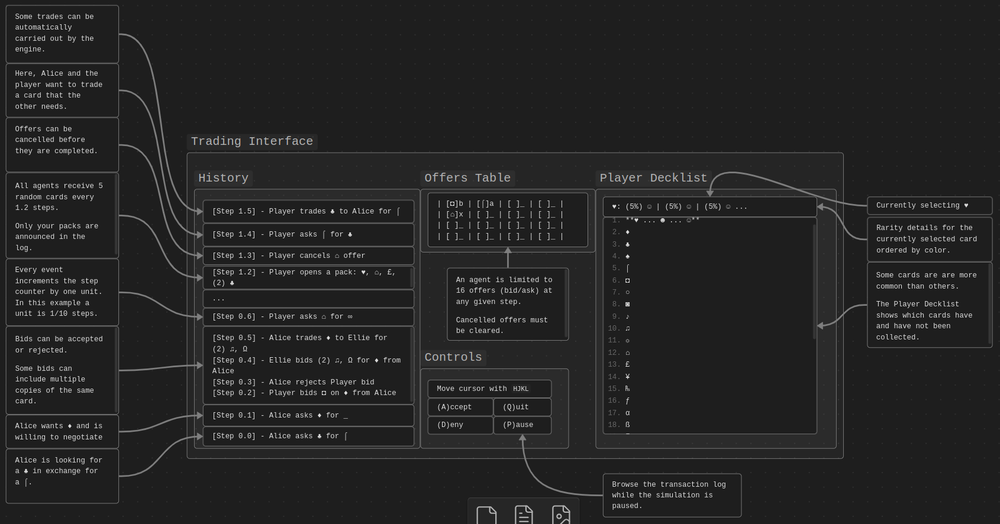

# Tiny Transaction

Tiny Transaction is a market simulator for a toy model card game that runs in
the terminal.

## Background

Tiny Transaction simulates a market for a toy model trading card game.
The market is made up of a player agent and many other automated agents.
Everyone in the market has a set of cards that they can collect and trade.
**The goal of each simulated run is to collect one copy of each card by trading**
**cards with other agents**.
Every card is made up of a symbol and a color.
There are 32 possible symbols and 8 different colors for a total of 256 cards.
Some trades are automatically carried out by the auction engine called `txny`
and other trades are negotiable.

## Motivation

When Pokémon Trading Card Game Pocket (PTCGP) edition released, I was excited
to trade cards with my friends like we used to as kids.
But, PTCGP initially released without a way to trade cards.

I was surprised because trading has been part of the Pokémon games since the
start of the franchise.
So I started thinking about how I would add trading to the game, if I was one
of the game developers.
Other games like Old School RuneScape use an automated auctioneer to match
offers on behalf of players and I thought that a similar approach would work
for a card game like PTCGP, too.

To demonstrate how, I built Tiny Transaction.

Learn more at [Elliot's Maker Space](https://elliotsmaker.space/2025-02-18-tiny-transaction-dev-log-0).

## Installation

### Source

Clone this repository.

```shell
$ git clone git@github.com:nurriol2/tiny-transaction.git
```

Move into the cloned directory.

```shell
$ cd tiny-transaction/
```

Build the program in release mode.

```shell
$ cargo build --release
```

Run the executable binary at `target/release/txny`.
Running the executable on Linux might look like this:

```shell
$ cd target/release/
$ ./txny
```

### Cargo

Tiny Transaction can be installed using [Cargo](https://doc.rust-lang.org/book/ch01-03-hello-cargo.html).

Add the `txny` executable to the root's `bin` directory.

```shell
$ cargo install tiny-transaction
```

By default, the `bin` directory is found at `$HOME/.cargo/bin`.
This location must be included in your `$PATH` to run the executable.

Running the executable on Linux might look like this:

```shell
$ ./txny
```

## Usage

Tiny Transaction opens to a terminal user interface (TUI) showing a basic
welcome screen.


The most important option on this screen is the `(P)lay` option.
Press `p` to start a new simulation.
Follow the on-screen instructions to launch the trading interface.


The simulation will be immediately paused when the trading interface opens for
the first time.

The controls panel is located in the middle third of the primary user interface.
It always shows the currently available controls.

## Trading Interface Overview

The figure below summarizes the main parts of the trading interface, after a
simulation has started running.



### History

This left-third of the trading interface is responsible for announcing the
events that have happened during the simulation.

When an agent posts/cancels an offer, a trade is completed, or the player opens
a pack, it appears as a step in the history.
Each event increments the step counter.

After a threshold number of steps, the player and all agents receive a pack of
5 random cards to add to their deck list.

### Offers Table

This middle-third of the trading interface is responsible for showing all the
currently open offers that the player has.

The player can have a maximum of 16 offers at once.

There are four possible states for an offer.

1. `_` - An empty offer slot that is available to post an offer
2. `a` - An ask type offer; a card that the player wants
3. `b` - A bid type offer; a card that the player is trading away
4. `x` - A cancelled offer; this slot must be cleared before a new offer is made

### Player Deck List

This right-third of the trading interface is responsible for showing which cards
the player does and doesn't have.

For a given symbol, the rarity of each color is shown at the top of this panel.
Collected cards are marked with the `☻` symbol of a corresponding color.
Cards that are not yet collected are marked with the `☺` symbol of a corresponding color.

## Contributing

Currently, only pull requests to correct typos and add errata are accepted.
In the future, pull requests for other issues will be accepted.

Thank you for your attention and interest. Let's work together!

Email me at: elliotsmakerspace@gmail.com

## License

[MIT](https://choosealicense.com/licenses/mit/)
